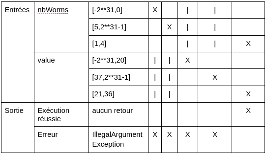
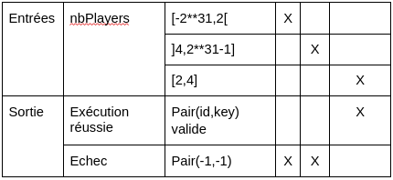
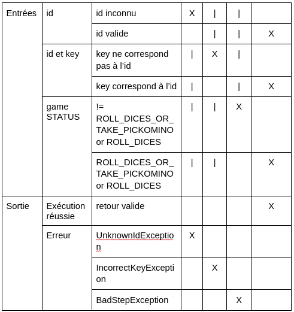
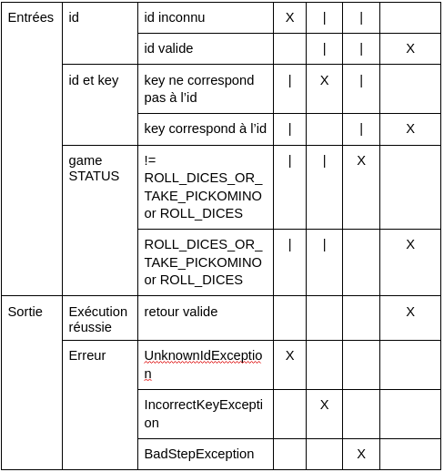
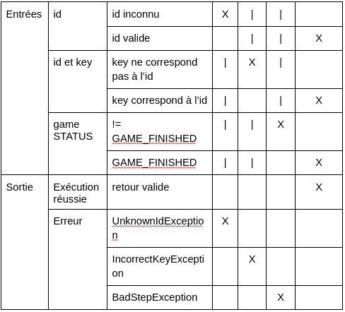
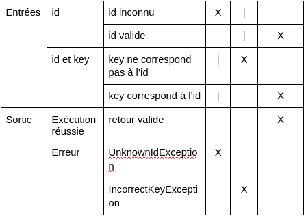
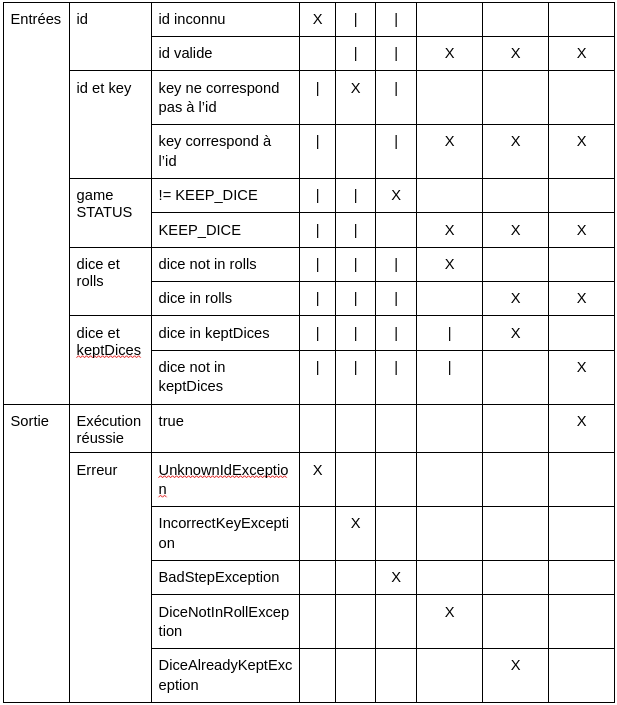
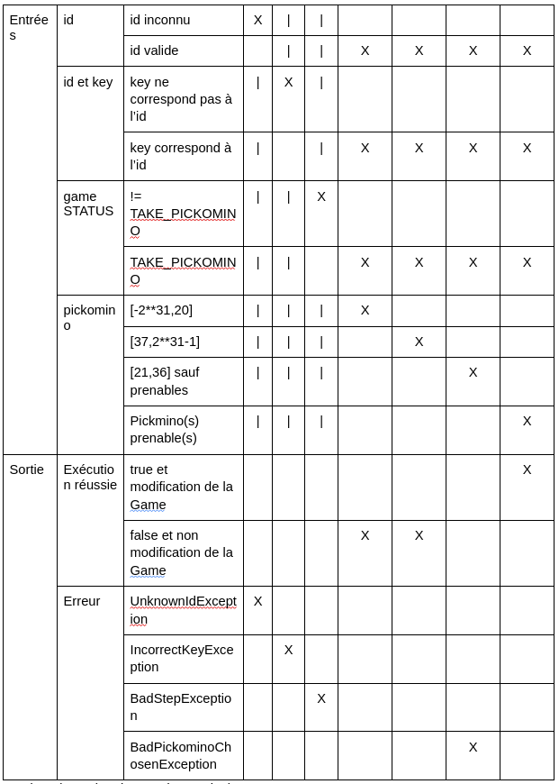

**Analyse des aspects de testabilité du jeu Pickomino**

Nous avons analysé les différents aspects du jeu Pickomino afin d'identifier les points de vigilance importants pour assurer sa testabilité sur plusieurs aspects :

1. Mécaniques de jeu
2. Interface utilisateur
3. Gestion des erreurs et des exceptions
4. Intégration des règles du jeu
5. Tests unitaires
6. Tests d'intégration
7. Automatisation des tests

### Mécaniques de jeu

Nous avons identifié la nécessité de bien comprendre et spécifier les mécaniques de jeu de Pickomino. Le jeu implique différentes mécaniques, telles que le lancer de dés, la collecte de tuiles et les interactions entre les joueurs. Il est important de tester toutes les combinaisons possibles d'actions et d'interactions pour garantir le bon fonctionnement du code. Une bonne construction du code et des fonctions bien liées faciliteront les tests efficaces. La compréhension précise des mécaniques de jeu nous permettra de créer des tests exhaustifs couvrant toutes les fonctionnalités.

### Interface utilisateur

L'interface utilisateur doit être testée en termes de convivialité et d'intuitivité. Il est essentiel de s'assurer que l'interface offre une expérience de jeu agréable aux utilisateurs. Les tests doivent couvrir tous les éléments de l'interface, tels que les boutons, les menus et les éléments interactifs, pour vérifier leur bon fonctionnement et leur affichage correct des informations de jeu. La testabilité de l'interface peut représenter un défi, notamment pour simuler différentes combinaisons d'actions. Il est important de mettre en place des techniques de test spécifiques et de s'assurer que le code gère correctement les transitions entre les tours des joueurs pour éviter les erreurs de données.

### Gestion des erreurs et des exceptions

La gestion adéquate des erreurs et des exceptions dans l'application de jeu Pickomino est essentielle pour assurer une expérience de jeu fluide. Des exceptions telles que "BadPickominoChosenException", "DiceAlreadyKeptException" et "IncorrectKeyException" doivent être correctement gérées. En identifiant ces exceptions spécifiques et en fournissant des messages d'erreur clairs aux joueurs, nous évitons les actions incorrectes, assurons l'intégrité du jeu et offrons une expérience de jeu cohérente et sans interruptions indésirables.

### Intégration des règles du jeu

L'intégration précise des règles du jeu dans l'application est un point crucial. Il est important de s'assurer que les règles du jeu sont correctement implémentées et respectées. Cela inclut la vérification des fonctionnalités telles que le lancer des dés, la gestion des points et les décisions prises par les joueurs pour garantir leur conformité aux règles établies.

### Tests unitaires

Pour garantir la qualité de l'application, nous recommandons la création de tests unitaires pour chaque composant de l'application. Ces tests doivent couvrir les différentes fonctionnalités du jeu, les classes et les méthodes utilisées. Ils nous permettront de vérifier le bon fonctionnement de chaque partie de l'application de manière indépendante.

### Tests d'intégration

Les tests d'intégration sont indispensables pour s'assurer que toutes les parties de l'application fonctionnent harmonieusement ensemble. Nous devons nous assurer que les différentes fonctionnalités du jeu, telles que le lancer des dés, la gestion des points et les interactions entre les joueurs, s'intègrent correctement et produisent les résultats attendus.

### Automatisation des tests

Enfin, si possible dans le temps imparti, nous envisagerons d'automatiser les tests pour faciliter leur exécution régulière et fiable. L'utilisation de scripts de test et d'outils d'intégration continue nous permettra d'automatiser les tests et d'assurer une couverture de test plus large.

Cela résume notre synthèse des différents aspects de testabilité du jeu Pickomino.

## Tests fonctionnels

### Pickomino : 
	nbWorms : Int 	-> [-2**31,2**31-1]
			2 partitions exceptionnelles 	-> [-2**31,0]
							-> [5,2**31-1]
			1 partition nominale		-> [1,4]

	value : Int 	-> [-2**31,2**31-1]
			2 partition exceptionnelles	-> [-2**31,20]
							-> [37,2**31-1]
			1 partition nominale 		-> [21,36]

CT1(DT(-3,10),IllegalArgumentException) 
CT2(DT(7,-100),IllegalArgumentException) 
CT3(DT(2,18),IllegalArgumentException) 
CT4(DT(2,40),IllegalArgumentException) 
CT5(DT(3,30),)//Aucun renvoi ni erreur 
L’implémentation du constructeur Pickomino n'inclut cependant aucun renvoi d'exception, et ces tests ne fonctionnent donc pas.

### Game

accessiblePickos est une fonction de récupération des données, et en l’absence du code, il n’est pas possible de concevoir des tests.

pickosStackTops est une fonction de récupération des données, et en l’absence du code, il n’est pas possible de concevoir des tests.

score est une fonction de récupération des données, et en l’absence du code, il n’est pas possible de concevoir des tests.

### Connector

#### newGame :
    nbPlayers : Int	-> [-2**31,2**31-1]
		2 partitions exceptionnelles	-> [-2**31,2[
						-> ]4,2**31-1]
		1 partition nominale		-> [2,4]

CT1(DT1(-3),Pair(-1,-1)) 
CT2(DT2(5),Pair(-1,-1)) 
CT3(DT3(3),!=Pair(1,1))

#### rollDices :
    id : Int
		1 partition exceptionnelle	-> id inconnu
		1 partition nominale		-> id valide

	id et key
		1 partition exceptionnelle	-> la key ne correspond pas à l’id
		1 partition nominale		-> la key correspond à l’id
	game STATUS : GAME_FINISHED, TAKE_PICKOMINO, KEEP_DICE, ROLL_DICE_OR_TAKE_PICKOMINO, ROLL_DICE
		1 partition exceptionnelle	-> != ROLL_DICES_OR_TAKE_PICKOMINO or ROLL_DICES
		1 partition nominale		-> ROLL_DICES_OR_TAKE_PICKOMINO or ROLL_DICES

CT1(DT1(-1,0),UnknownIdException) 
CT2(DT2(x,y-1),IncorrectKeyException) avec (id,key)=(x,y) valide 
CT3(DT3(x,y),BadStepException) avec game STATUS != ROLL_DICES_OR_TAKE_PICKOMINO or ROLL_DICES et (id,key)=(x,y) valide 
CT4(DT4(x,y),sortie valide) avec game STATUS = ROLL_DICES_OR_TAKE_PICKOMINO or ROLL_DICES et (id,key)=(x,y) valide

#### choiceDices :
    id : Int
		1 partition exceptionnelle	-> id inconnu
		1 partition nominale		-> id valide

	id et key
		1 partition exceptionnelle	-> la key ne correspond pas à l’id
		1 partition nominale		-> la key correspond à l’id
	game STATUS : GAME_FINISHED, TAKE_PICKOMINO, KEEP_DICE, ROLL_DICE_OR_TAKE_PICKOMINO, ROLL_DICE
		1 partition exceptionnelle	-> != ROLL_DICES_OR_TAKE_PICKOMINO or ROLL_DICES
		1 partition nominale		-> ROLL_DICES_OR_TAKE_PICKOMINO or ROLL_DICES

CT1(DT1(-1,0,list(DICE.d1*8),UnknownIdException) 
CT2(DT2(x,y-1,list(DICE.d1*8),IncorrectKeyException) avec (id,key)=(x,y) valide 
CT3(DT3(x,y,list(DICE.d1*8),BadStepException) avec game STATUS != ROLL_DICES_OR_TAKE_PICKOMINO or ROLL_DICES et (id,key)=(x,y) valide 
CT4(DT4(x,y,list(DICE.d1*8),sortie valide) avec game STATUS = ROLL_DICES_OR_TAKE_PICKOMINO or ROLL_DICES et (id,key)=(x,y) valide

#### finalScore :
    id : Int
		1 partition exceptionnelle	-> id inconnu
		1 partition nominale		-> id valide

	id et key
		1 partition exceptionnelle	-> la key ne correspond pas à l’id
		1 partition nominale		-> la key correspond à l’id
	game STATUS : GAME_FINISHED, TAKE_PICKOMINO, KEEP_DICE, ROLL_DICE_OR_TAKE_PICKOMINO, ROLL_DICE
		1 partition exceptionnelle	-> != GAME_FINISHED
		1 partition nominale		-> GAME_FINISHED

CT1(DT1(-1,0),UnknownIdException) 
CT2(DT2(x,y-1),IncorrectKeyException) avec (id,key)=(x,y)  
CT3(DT3(x,y),BadStepException) avec game STATUS != GAME_FINISHED et (id,key)=(x,y) valide 
CT4(DT4(x,y),sortie valide) avec game STATUS = GAME_FINISHED et (id,key)=(x,y) valide

#### gameState :
    id : Int
		1 partition exceptionnelle	-> id inconnu
		1 partition nominale		-> id valide

	id et key
		1 partition exceptionnelle	-> la key ne correspond pas à l’id
		1 partition nominale		-> la key correspond à l’id

CT1(DT1(-1,0),UnknownIdException) 
CT2(DT2(x,y-1),IncorrectKeyException) avec (id,key)=(x,y) valide 
CT3(DT3(x,y),sortie valide) avec (id,key)=(x,y) valide

#### keepDices :
    id : Int
		1 partition exceptionnelle	-> id inconnu
		1 partition nominale		-> id valide

	id et key
		1 partition exceptionnelle	-> la key ne correspond pas à l’id
		1 partition nominale		-> la key correspond à l’id
	game STATUS : GAME_FINISHED, TAKE_PICKOMINO, KEEP_DICE, ROLL_DICE_OR_TAKE_PICKOMINO, ROLL_DICE
		1 partition exceptionnelle	-> != KEEP_DICE
		1 partition nominale		-> KEEP_DICE
	dice et rolls
		1 partition exceptionnelle	-> dice not in rolls
		1 partition nominale		-> dice in rolls
	dice et keptDices
		1 partition exceptionnelle	-> dice in keptDices
		1 partition nominale		-> dice not in keptDices

CT1(DT1(-1,0,DICE.worm),UnknownIdException) 
CT2(DT2(x,y-1,DICE.worm),IncorrectKeyException) avec (id,key)=(x,y) valide 
CT3(DT3(x,y,DICE.worm),BadStepException) avec game STATUS != KEEP_DICE et (id,key)=(x,y) valide 
CT4(DT4(x,y,DICE.d1),DiceNotInRollException) avec game STATUS = KEEP_DICE, (id,key)=(x,y) valide et DICE.d1 not in rolls 
CT5(DT5(x,y,DICE.worm),DiceAlreadyKeptException) avec game STATUS = KEEP_DICE, (id,key)=(x,y) valide, DICE.worm in rolls et DICE.d1 in keptDices 
CT6(DT6(x,y,DICE.d1),sortie valide) avec game STATUS = KEEP_DICE, (id,key)=(x,y) valide, DICE.d1 in rolls et DICE.d1 not in keptDices 

avec rolls = (DICE.worm,DICE.worm,DICE.worm,DICE.worm,DICE.worm,DICE.worm,DICE.worm,DICE.worm) sauf pour CT5 et CT6

#### takePickomino :

    id : Int
		1 partition exceptionnelle	-> id inconnu
		1 partition nominale		-> id valide

	id et key
		1 partition exceptionnelle	-> la key ne correspond pas à l’id
		1 partition nominale		-> la key correspond à l’id
	game STATUS : GAME_FINISHED, TAKE_PICKOMINO, KEEP_DICE, ROLL_DICE_OR_TAKE_PICKOMINO, ROLL_DICE
		1 partition exceptionnelle	-> != TAKE_PICKOMINO
		1 partition nominale		-> TAKE_PICKOMINO
	pickomino : Int		-> [-2**31,2**31-1]
			2 partition exceptionnelles	-> [-2**31,20]
							-> [37,2**31-1]
			2 partition nominale 		-> [21,36] sauf le(s) Pickomino(s) prenable(s)
							-> le(s) Pickomino(s) prenable(s)

CT1(DT1(-1,0,0),UnknownIdException) 
CT2(DT2(id,key-1,0),IncorrectKeyException) avec (id,key)=(x,y) valide 
CT3(DT3(x,y,0),BadStepException) avec game STATUS != TAKE_PICKOMINO et (id,key)=(x,y) valide 
CT4(DT4(x,y,0),false) avec game STATUS != TAKE_PICKOMINO et (id,key)=(x,y) valide 
CT5(DT5(x,y,40),false) avec game STATUS != TAKE_PICKOMINO et (id,key)=(x,y) valide 
CT6(DT6(x,y,21),BadPickominoChosenException) avec game STATUS != TAKE_PICKOMINO et (id,key)=(x,y) valide 
CT7(DT4(x,y,36),true) avec game STATUS = TAKE_PICKOMINO et (id,key)=(x,y) valide 

avec keptDices = (DICE.worm,DICE.worm,DICE.worm,DICE.worm,DICE.worm,DICE.worm,DICE.worm,DICE.worm)

listOfGameIds est une fonction de récupération des données, et en l’absence du code, il n’est pas possible de concevoir des tests.

Texte écrit à 17h le 21 juin 
A l’heure actuelle, comme signalé dans l’Issue #16, la méthode takePickomino ne lance pas d’Exception quand l’id est inconnu, que la key ne correspond pas à l’id ou que l’action ne correspond pas à l’étape actuelle de la partie. Nous avons donc mis en commentaire les 3 tests validant ce comportement erroné du serveur. Ce sont les tests testTakePickomino1, testTakePickomino2 et testTakePickomino3 situés à la ligne 180 dans le fichier ConnectorTest.

